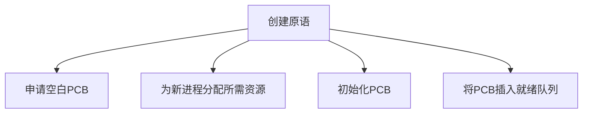
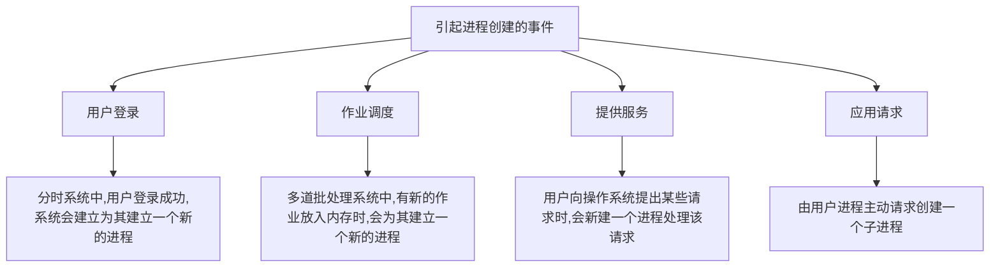
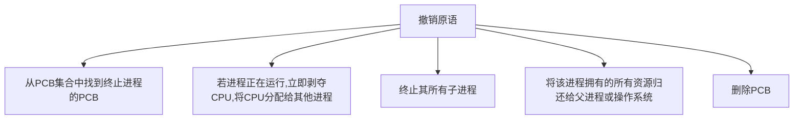
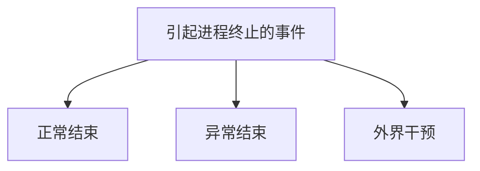
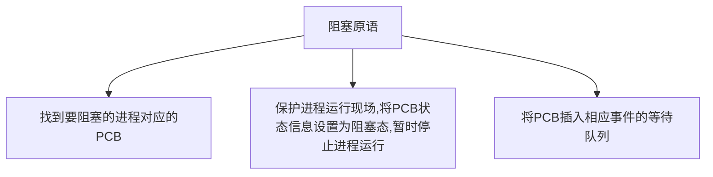
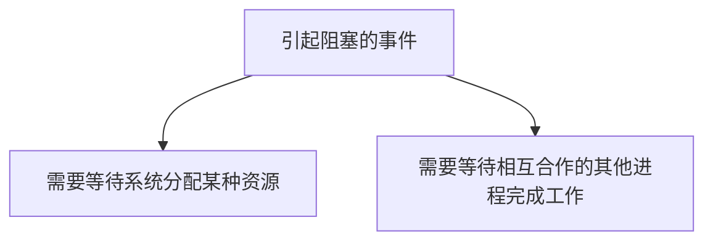
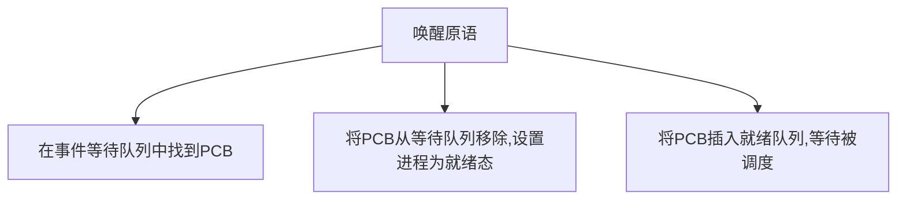
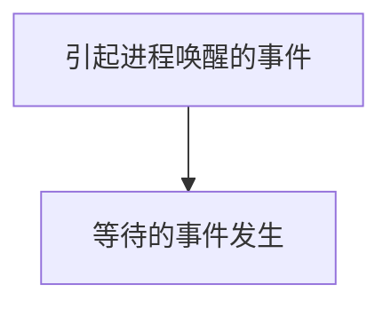
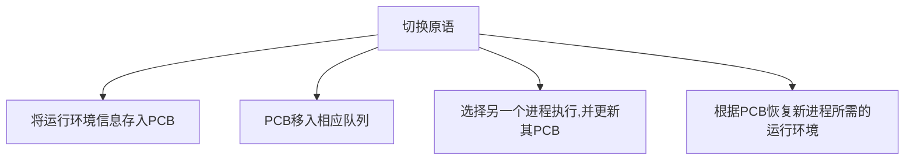
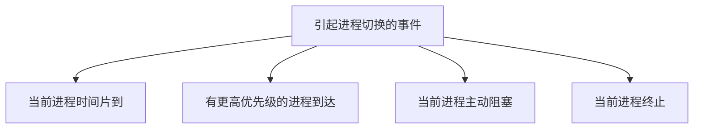

[toc!?depth=4]

----------

# 进程

## 概念
程序:是==静态的 #EE3F4D==,就是个存放在磁盘里的可执行文件,就是一系列的指令集合。
进程(Process) :是==动态的 #EE3F4D==,是程序的一次执行过程。同一个程序多次执行会对应多个进程
当进程被创建时,操作系统会为该进程分配一个==唯一的、不重复 #EE3F4D==的“身份证==PID #EE3F4D== (Process ID,进程ID)

## 组成
### PCB
这些信息都被保存在一个数据结构==PCB #EE3F4D== (Process Control Block)中,即进程控制块
操作系统需要对各个并发运行的进程进行管理,==但凡管理时所需要的信息,都会被放在PCB中 #EE3F4D==
PCB是进程存在的唯一标志,当进程被创建时,操作系统为其创建PCB,当进程结束时,会回收其PCB。
#### 进程描述信息
##### 进程标识符PID
##### 用户标识符UID
#### 进程控制和管理信息
##### CPU、磁盘、网络流量使用情况统计...
##### 进程当前状态:就绪态/阻塞态/运行态...
#### 资源分配清单
##### 正在使用哪些文件
##### 正在使用哪些内存区域
##### 正在使用哪些I/O设备
#### 处理机相关信息
##### 如PSW、PC等等各种寄存器的值(用 于实现进程切换)
### 程序段
PCB是给==操作系统 #EE3F4D==用的。
程序段、数据段是给==进程自己 #EE3F4D==用的。
一个==进程实体(进程映像) #EE3F4D==由==PCB、程序段、数据段 #EE3F4D==组成。
==进程 #EE3F4D==是==动态 #EE3F4D==的,==进程实体(进程映像) #EE3F4D==是==静态 #EE3F4D==的。
进程是进程实体的==运行过程 #12AA9C==,是系统进行资源分配和调度的一个独立单位。
#### 程序的代码(指令序列)
### 数据段
#### 运行过程中产生的各种数据(如:程序中定义的变量)

## 特征
### 动态性
进程是程序的一次执行过程,是动态地产生、变化和消亡的
### 并发性
内存中有多个进程实体,各进程可并发执行
### 独立性
进程是能独立运行、独立获得资源、独立接受调度的基本单位
### 异步性
各进程按各自独立的、不可预知的速度向前推进,操作系统要提供"进程同步机制"来解决异步问题
### 结构性
每个进程都会配置-个PCB。结构上看,进程由程序段、数据段、PCB组成

## 状态
### 运行状态
如果一个进程此时在CPU上运行,那么这个进程处于“==运行态 #EE3F4D==”
CPU会执行该进程对应的程序(执行指令序列)
### 就绪状态
当进程创建完成后,便进入“==就绪态 #EE3F4D==”,处于就绪态的进程已经具备运行条件,但由于没有空闲CPU,就暂时不能运行
### 阻塞状态
在进程运行的过程中,可能会==请求等待某个事件的发生 #EE3F4D==(如等待某种系统资源的分配,或者等待其他进程的响应)。
在这个事件发生之前,进程无法继续往下执行,此时操作系统会;让这个进程下CPU,并让它进入“==阻塞态 #EE3F4D==”
当CPU空闲时,又会选择另一个“就绪态”进程上CPU运行
### 创建状态
别名：==新建态 #EE3F4D==
进程正在被创建时,它的状态是"==创建态 #EE3F4D==”,在这个阶段操作系统会为进程分配资源、初始化PCB
### 终止状态
别名：==结束态 #EE3F4D==
一个进程可以执行exit系统调用,请求操作系统终止该进程。此时该进程会进入“==终止态 #EE3F4D==”,操作系统会让该进程下CPU,并回收内存空间等资源,最后还要回收该进程的PCB。
当终止进程的工作完成之后,这个进程就彻底消失了。
## 状态间的转换
进程PCB中,会有一个变量state来表示进程的当前状态。如: 1表示创建态、2表示就绪态、3表示运行态..
### 就绪态- ->运行态 
进程被调度
### 运行态- ->就绪态 
时间片到,或处理机被抢占
### 运行态- ->阻塞态 
进程用“系统调用”的方式申请某种系统资源,或者请求等待某个事件发生
运行态->阻塞态是一种进程自身做出的==主动行为 #EE3F4D==
### 阻塞态- ->就绪态
申请的资源被分配,或等待的事件发生
阻塞态->就绪态是不是进程自身能控制的,是一种==被动行为 #EE3F4D==。
注意:==不能由阻塞态直接转换为运行态,也不能由就绪态直接转换为阻塞态 #EE3F4D==(因为进入阻塞态是进程主动请求的,必然需要进程在运行时才能发出这种请求)
## 进程的组织方式(各个进程PCB的组织方式)
为了对同一个状态下的各个进程进行统一 的管理,操作系统会将各个进程的PCB组织起来。
### 链接方式
按照进程状态将PCB分为多个队列
操作系统持有指向各个队列的指针
### 索引方式
根据进程状态的不同,建立几张索引表
操作系统持有指向各个索引表的指针

## 进程控制
### 基本概念
进程控制的主要功能是对系统中的所有进程实施有效的管理,它具有创建新进程、撤销已有进程、实现进程状态转换等功能。
简化理解:反正进程控制就是要实现进程状态转换
### 如何实现进程控制
#### 用“原语”实现
原语是一种特殊的程序,它的==执行具有原子性 #EE3F4D==也就是说,这段程序的运行必须==一气呵成,不可中断 #EE3F4D==
可以用“==关中断 #EE3F4D==指令”和“==开中断 #EE3F4D==指令”这两个==特权指令 #EE3F4D==实现==原子性 #EE3F4D==
CPU执行了==关中断指令 #EE3F4D==之后,就不再例行检查中断信号,直到执行==开中断指令 #EE3F4D==之后才会恢复检查。
### 进程控制相关的原语
#### 进程的创建

#### 进程的终止

#### 进程的阻塞

#### 进程的唤醒

#### 进程的切换

## 进程间通信
进程间通信( Inter-Process Communication,==IPC #EE3F4D==)是指两个进程.之间产生数据交互。
进程是分配系统资源的单位(包括内存地址空间),， 因此==各进程 #EE3F4D==拥有的==内存地址空间相互独立 #EE3F4D==。
为了保证安全，==一个进程不能直接访问另一个进程的地址空间 #EE3F4D==。
### 共享存储
注:通过“增加页表项/段表项”即可将同一片共享内存区映射到各个进程的地址空间中(第三章内容)
为避免出错，各个进程对共享空间的==访问 #EE3F4D==应该是==互斥 #EE3F4D==的。
==基于存储区 #EE3F4D==的共享:操作系统在内存中划出一块共享存储区，数据的形式、存放位置都由通信进程控制，而不是操作系统。这种共享方式速度很快，是一种==高级通信 #EE3F4D==方式。
==基于数据结构 #EE3F4D==的共享:比如共享空间里只能放一个长度为10的数组。这种共享方式速度慢、限制多，是一种==低级通信 #EE3F4D==方式.
### 消息传递
进程间的数据交换以==格式化的消息 #EE3F4D==( Message)为单位。进程通过操作系统提供的“发送消息/接收消息”两个==原语 #EE3F4D==进行数据交换。
#### 直接通信方式
消息发送进程要指明接收进程的ID
#### 间接通信方式
通过“信箱”间接地通信。因此又称“信箱通信方式”
### 管道通信
“管道”是一个特殊的共享文件，又名pipe文件。其实就是在内存中开辟一个大小固定的内存缓冲区
1. 管道只能采用==半双工通信 #EE3F4D==，某一时间段内只能实现单向的传输。如果要实现==双向同时通信 #EE3F4D==，则==需要设置两个管道 #EE3F4D==。
2. 各进程要==互斥 #EE3F4D==地访问管道(由操作系统实现)
3. 当==管道写满 #EE3F4D==时，==写进程 #EE3F4D==将==阻塞 #EE3F4D==，直到读进程将管道中的数据取走，即可唤醒写进程。
4. 当==管道读空 #EE3F4D==时，==读进程 #EE3F4D==将==阻塞 #EE3F4D==，直到写进程往管道中写入数据，即可唤醒读进程。
5. 管道中的数据一旦被读出，就彻底消失。因此，当多个进程读同一个管道时，可能会错乱。对此，通常有两种解决方案:①==一个管道允许多个写进程，一个读进程 #EE3F4D==(2014年408真题高教社官方答案) ;②==允许有多个写进程，多个读进程 #EE3F4D==，但系统会让各个读进程轮流从管道中读数据(Linux 的方案)。
写进程往管道写数据，即便管道没被写满，==只要管道没空，读进程就可以从管道读数据 #EE3F4D==
读进程从管道读数据，即便管道没被读空，==只要管道没满，写进程就可以往管道写数据 #EE3F4D==

## 线程、多线程模型
### 什么是线程，为什么要引入线程?
还没引入进程之前，系统中各个程序只能串行执行。
进程是程序的一次执行。但这些功能显然不可能是由一个程序顺序处理就能实现的
有的进程可能需要“同时”做很多事，而传统的进程只能串行地执行一系列程序。为此，引入了“线程”，来增加并发度。
传统的进程是程序执行流的最小单位
引入线程后，线程成为了程序执行流的最小单位
==线程 #EE3F4D==是一个==基本的CPU执行单元 #EE3F4D==，也是==程序执行流的最小单位 #EE3F4D==。引入线程之后，不仅是进程之间可以并发，进程内的==各线程之间 #EE3F4D==也可以==并发 #EE3F4D==，从而进一步==提升了系统的并发度 #EE3F4D==，使得一一个进程内也可以并发处理各种任务(如QQ视频、文字聊天、传文件)
引入线程后，==进程 #EE3F4D==只作为==除CPU之外的系统资源的分配单元 #EE3F4D==(如打印机、内存地址空间等都是分配给进程的)。
### 引入线程机制后，有什么变化?
#### 资源分配、调度
传统进程机制中，进程是资源分配、调度的基本单位
引入线程后，进程是资源分配的基本单位，线程是调度的基本单位
#### 并发性
传统进程机制中，只能进程间并发
引入线程后，各线程间也能并发，提升了并发度
#### 系统开销
传统的进程间并发，需要切换进程的运行环境，系统开销很大
线程间并发，如果是同一进程内的线程切换，则不需要切换进程环境，系统开销小
引入线程后，并发所带来的系统开销减小
### 线程有哪些重要的属性
线程是处理机调度的单位
多CPU计算机中，各个线程可占用不同的CPU
每个线程都有一个线程ID、线程控制块(TCB)
线程也有就绪、阻塞、运行三种基本状态
线程几乎不拥有系统资源
同一进程的不同线程间共享进程的资源
由于共享内存地址空间,同一进程中的线程间通信甚至无需系统干预
同一进程中的线程切换，不会引起进程切换
不同进程中的线程切换，会引起进程切换
切换同进程内的线程，系统开销很小
切换进程,系统开销较大
### 线程的实现方式
#### 用户级线程
历史背景:早期的操作系统(如:早期Unix) 只支持进程，不支持线程。当时的“线程”是由线程库实现的
1.用户级线程由应用程序通过线程库实现，所有的==线程管理工作 #EE3F4D==都由==应用程序负责 #EE3F4D==(包括线程切换)
2.用户级线程中，==线程切换 #EE3F4D==可以在==用户态下即可完成 #EE3F4D==，无需操作系统干预。
3.在用户看来，是有多个线程。但是在操作系统内核看来，并意识不到线程的存在。
==“用户级线程” #EE3F4D==就是==“从用户视角看能看到的线程” #EE3F4D==
4.优缺点
优点:用户级线程的切换在用户空间即可完成，不需要切换到核心态，线程管理的系统开销小，效率高
缺点:当一个用户级线程被阻塞后，整个进程都会被阻塞，并发度不高。多个线程不可在多核处理机上并行运行。
#### 内核级线程
由操作系统支持的线程
1.==内核级线程的管理工作 #EE3F4D==由==操作系统内核 #EE3F4D==完成。
2.线程调度、切换等工作都由内核负责，因此==内核级线程的切换 #EE3F4D==必然需要在==核心态 #EE3F4D==下才能完成。
3.操作系统会为每个内核级线程建立相应的TCB (Thread Control Block，线程控制块)通过TCB对线程进行管理。=="内核级线程" #EE3F4D==就是=="从操作系统内核视角看能看到的线程” #EE3F4D==
4.优缺点
优点:当一个线程被阻塞后，别的线程还可以继续执行，并发能力强。多线程可在多核处理机上并行执行。
缺点:一个用户进程会占用多个内核级线程，线程切换由操作系统内核完成，需要切换到核心态，因此线程管理的成本高，开销大。
### 多线程模型
#### 多对一模型

#### 一对一模型

#### 多对多模型