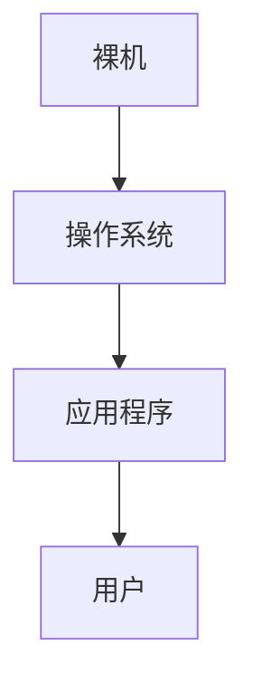
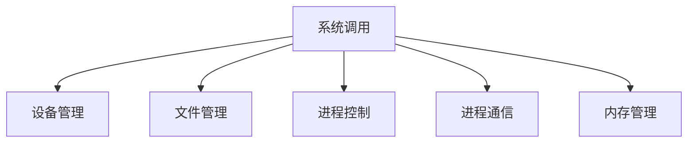

[toc!?depth=3]

----------

# 操作系统引论
## 概念（定义）
==操作系统 #EE3F4D==(Operating System，OS) 是指控制和==管理 #FC7930==整个计算机系统的==硬件和软件 #FC7930==资源，并合理地组织调度计算机的工作和资源的分配;以==提供给用户和其他软件方便的接口和环境 #FC7930==;它是计算机系统中最基本的==系统软件 #FC7930==。
### 层次结构

## 功能和目标
### 作为系统资源的管理者
#### 提供的功能
处理机管理
存储器管理
文件管理
设备管理
#### 目标
安全，高效
### 向上层提供方便易用的服务
#### 直接给用户使用的
GUI（图形用户界面）封装思想:操作系统把一-些丑陋的硬件功能封装成简单易用的服务，使用户能更方便地使用计算机，用户无需关心底层硬件的原理，只需要对操作系统发出命令即可
联机命令接口实例(Windows系统) 联机命令接口=交互式命令接口
脱机命令接口实例(Windows系统) 脱机命令接口=批处理命令接口
#### 给软件/给程序员使用的
程序接口：可以在程序中进行系统调用来使用程序接口。普通用户不能直接使用程序接口，只能通过程序代码间接使用。
### 作为最接近硬件的层次
通常把覆盖了软件的机器成为==扩充机器 #FC7930==，又称之为==虚拟机 #EE3F4D==

## 四个特征
### 并发
==并发 #EE3F4D==:指两个或多个事件在同一时间间隔内发生。这些事件==宏观上是同时发生 #FC7930==的，但微观上是交替发生的。
常考易混概念——==并行 #EE3F4D==:指两个或多个事件在同一时刻同时发生。
==操作系统的并发性 #EE3F4D==指计算机系统中“同时”运行着多个程序，这些程序宏观上看是同时运行看的，而微观上看是交替运行的。
操作系统就是伴随着“多道程序技术”而出现的。因此，==操作系统和程序并发是一起诞生的 #EE3F4D==。
重点：
==单核CPU #EE3F4D==同一时刻只能执行一个程序，各个程序只能==并发 #FC7930==地执行
==多核CPU #EE3F4D==同一时刻可以同时执行多个程序，多个程序可以==并行 #FC7930==地执行
### 共享
==共享 #EE3F4D==即资源共享，是指系统中的资源可供内存中多个并发执行的进程共同使用。
#### 互斥共享方式
系统中的某些资源，虽然可以提供给多个进程使用，但==一个时间段内只允许一个进程访问该资源 #FC7930==
#### 同时共享方式
系统中的某些资源，==允许一个时间段内由多个进程“同时”对它们进行访问 #FC7930==
所谓的“同时”往往是宏观上的，而在微观上，这些进程可能是交替地对该资源进行访问的(即分时共享)
==并发性 #EE3F4D==指计算机系统中同时存在着多个运行着的程序。
==共享性 #EE3F4D==是指系统中的资源可供内存中多个并发执行的进程共同使用。
### 虚拟
==虚拟 #EE3F4D==是指把一个物理上的实体变为若千个逻辑上的对应物。物理实体(前者)是实际存在的，而逻辑上对应物(后者)是用户感受到的。
一个程序需要放入内存并给它分配CPU才能执行
#### 空分复用技术(如虚拟存储器技术)
#### 时分复用技术(如虚拟处理器)
显然，如果失去了并发性，则一个时间段内系统中只需运行一道程序，那么就失去了实现虚拟性的意义了。因此，==没有并发性，就谈不上虚拟性 #EE3F4D==。
### 异步
==异步 #EE3F4D==是指，在多道程序环境下，允许多个程序并发执行，但由于资源有限，进程的执行不是一贯到底的，而是走走停停，以不可预知的速度向前推进，这就是进程的异步性。
如果失去了并发性，即系统只能串行地运行各个程序，那么每个程序的执行会一贯到底。只有系统拥有并发性，才有可能导致异步性。

## OS的发展与分类
学习提示:要重点关注和理解各类操作系统主要想解决的是什么问题，各自的优缺点。
### 手工操作阶段
主要缺点:用户独占全机、人机速度矛盾导致资源利用率极低
### 批处理阶段
#### 单道批处理系统
引入==脱机输入/输出技术 #EE3F4D==(用外围机+磁带完成)，并由==监督程序 #EE3F4D==负责控制作业的输入、输出
主要缺点:==内存中仅能有一道程序运行 #EE3F4D==，只有该程序运行结束之后才能调入下一-道程序。==CPU有大量的时间是在空闲等待I/O完成 #EE3F4D==。资源利用率依然很低。
#### 多道批处理系统(操作系统开始出现)
主要优点:多道程序==并发 #EE3F4D==执行，==共享 #EE3F4D==计算机资源。==资源利用率大幅提升 #EE3F4D==，CPU和其他资源更能保持“忙碌”状态，系统吞吐量增大。
主要缺点:用户响应时间长，==没有人机交互功能 #EE3F4D==(用户提交自己的作业之后就只能等待计算机处理完成，中间不能控制自己的作业执行。eg: 无法调试程序/无法在程序运行过程中输入一 些参数)
### 分时操作系统
分时操作系统:计算机以==时间片 #EE3F4D==为单位==轮流为各个用户/作业服务 #EE3F4D==，各个用户可通过终端与计算机进行交互。
主要优点:用户请求可以被即时响应，==解决了人机交互问题 #EE3F4D==。允许多个用户同时使用一台计算机，并且用户对计算机的操作相互独立，感受不到别人的存在。
主要缺点:==不能优先处理一些紧急任务 #EE3F4D==。 操作系统对各个用户/作业都是完全公平的，循环地为每个用户/作业服务-一个时间片，不区分任务的紧急性。
### 实时操作系统
主要优点:能够优先响应一些紧急任务，某些紧急任务不需时间片排队。
在实时操作系统的控制下，计算机系统接收到外部信号后及时进行处理，并且==要在严格的时限内处理完事件 #EE3F4D==。实时操作系统的主要特点是==及时性和可靠性 #EE3F4D==
#### 硬实时系统
必须在绝对严格的规定时间内完成处理
### 软实时系统
能接受偶尔违反时间规定
### 网络操作系统
是伴随着计算机网络的发展而诞生的，能把网络中各个计算机有机地结合起来，实现数据传送等功能，==实现网络中各种资源的共享(如文件共享)和各台计算机之间的通信 #EE3F4D==。 (如: Windows NT就是一种典型的网络操作系统，网站服务器就可以使用)
### 分布式操作系统
分布式操作系统:主要特点是==分布性和并行性 #EE3F4D==。系统中的各台计算机地位相同，==任何工作都可以分布在这些计算机上，由它们并行、协同完成这个任务。 #EE3F4D==
### 个人计算机操作系统
如Windows XP、MacOS，方便个人使用。

## 运行机制
### 两种指令
“指令”就是处理器(CPU) 能识别、执行的最基本命令
在CPU设计和生产的时候==就划分了特权指令和非特权指令 #EE3F4D==，因此CPU执行一条指令前就能判断出其类型
#### 特权指令
操作系统内核作为“管理者”，有时会让CPU执行些“特权指令”，如:内存清零指令。这些指令影响重大，只允许“管理者”——即操作系统内核来使用
#### 非特权指令
应用程序只能使用“非特权指令”， 如:加法指令、减法指令等
### 两种处理器状态
CPU有两种状态， “==内核态 #EE3F4D==”和“==用户态 #EE3F4D==”
拓展: CPU 中有一个寄存器Q叫程序状态字寄存器(PSW) ，其中有个二进制位，1表
“内核态”，0表示“用户态”
操作系统内核在让出CPU之前，会==用一条特权指令把PSW的标志位设置为“用户态” #EE3F4D==
#### 内核态
处于==内核态时 #EE3F4D==，说明此时正在==运行的是内核程序 #EE3F4D==，此时==可以执行特权指令 #EE3F4D==
也可被称为核心态和==管态 #FC7930==
==内核态→用户态 #EE3F4D==:执行一条==特权指令 #EE3F4D==——==修改PSW #EE3F4D==的标志位为“用户态”，这个动作意味着操作系统将主动让出CPU使用权
#### 用户态
处于==用户态时 #EE3F4D==，说明此时正在==运行的是应用程序 #EE3F4D==，此时==只能执行非特权指令 #EE3F4D==
也可称为==目态 #FC7930==
==用户态->内核态 #EE3F4D==:由==“中断” #EE3F4D==引发，==硬件自动完成变态过程 #EE3F4D==，触发中断信号意味着操作系统将强行夺回CPU的使用权
### 两种程序
#### 内核程序
微软、苹果有一帮人负责实现操作系统，他们写的是“==内核程序 #EE3F4D==”由很多内核程序组成了“操作系统内核”，或简称“内核(Kernel)”内核是操作系统最重要最核心的部分，也是最接近硬件的部分甚至可以说，一个操作系统只要有内核就够了(eg: Docker- ->仅需Linux内核)
#### 应用程序
我们普通程序员写的程序就是“==应用程序 #EE3F4D==”

## 中断和异常
### 中断的作用
“中断”是==让操作系统内核夺回CPU使用权 #EE3F4D==的唯一途径
==如果没有“中断”机制，那么一旦应用程序上CPU运行，CPU就会一直运行这 个应用程序 #12AA9C==
### 中断的类型
#### 内中断（也称“异常”）
与当前执行的指令==有关 #EE3F4D==，中断信号来源于CPU==内部 #EE3F4D==
例子：有时候应用程序想请求操作系统内核的服务，此时会执行==一条特殊的指令——陷入指令 #EE3F4D==，该指令会引发一个内部中断信号
执行“陷入指令”，意味着应用程序主动地将CPU控制权还给操作系统内核。“系统调用”就是通过陷入指令完成的
故障：由错误条件引起的，可能被内核程序修复。内核程序修复故障后会把CPU使用权还给应用程序，让它继续执行下去。 如:缺页故障
终止：由致命错误引起，内核程序无法修复该错误，因此一般不再将CPU使用权还给引发终止的应用程序，而是直接终止该应用程序。如:整数除0、非法使用特权指令
#### 外中断
与当前执行的指令==无关 #EE3F4D==，中断信号来源于CPU==外部 #EE3F4D==
例子：时钟中断——由时钟部件发来的中断信号；I/O中断——由输入/输出设备发来的中断信号
### 中断机制的基本原理
==不同的中断信号，需要用不同的中断处理程序来处理 #EE3F4D==。当CPU检测到中断信号后，会根据中断信号的类型去查询“==中断向量表 #EE3F4D==”，以此来找到相应的中断处理程序在内存中的存放位置。

## 系统调用
### 什么是系统调用
“系统调用”是操作系统提供给应用程序(程序员/编程人员)使用的接口，可以理解为—种可供应用程序调用的特殊函数，==应用程序可以通过系统调用来请求获得操作系统内核的服务 #EE3F4D==
### 系统调用与库函数的区别
不涉及系统调用的库函数:如的“取绝对值”的函数
涉及系统调用的库函数:如“创建一个新文件”的函数
### 小例子:为什么系统调用是必须的?
Word和WPS同时打印
解决方法:由操作系统内核对共享资源进行统—的管理，并向上提供“系统调用”，用户进程想要使用打印机这种共享资源，只能通过系统调用向操作系统内核发出请求。内核会对各个请求进行协调处理。
### 什么功能要用系统调用实现?
应用程序通过==系统调用 #EE3F4D==请求操作系统的服务。而系统中的各种共享资源都由操作系统内核统一掌管， 因此==凡是与共享资源有关的操作(如存储分配、I/0操作、文件管理等)，都必须通过系统调用的方式向操作系统内核提出服务请求 #EE3F4D==，由操作系统内核代为完成。这样可以保证==系统的稳定性和安全性 #FC7930==，防止用户进行非法操作。
系统调用按功能分类

### 系统调用的过程
传递系统调用参数>执行陷入指令(==用户态 #EE3F4D==)→执行相应的内请求核程序处理系统调用(==核心态 #EE3F4D==)→返回应用程序
注意: 1. ==陷入指令 #EE3F4D==是在用户态执行的，执行陷入指令之后立即引发一个==内中断 #EE3F4D==，使CPU==进入核心态 #EE3F4D==
2.==发出系统调用请求 #EE3F4D==是在用户态==而对系统调用的相应处理 #EE3F4D==在==核心态 #EE3F4D==下进行
注意别名:
陷入指令=trap指令=访管指令

## 操作系统的体系结构
非内核功能(如GUI)
内核功能：进程管理、存储器管理、设备管理等功能；时钟管理；中断处理；原语(设备驱动、CPU切换等)
原语是一种特殊的程序，具有原子性。也就是说，这段程序的运行必须一气呵成，不可被“中断”
### 大内核/单内核/宏内核
==内核 #EE3F4D==是操作系统最基本、最核心的部分。实现操作系统内核功能的那些程序就是==内核程序 #EE3F4D==。
大内核包括内核所有功能，只有应用程序会用用户态，只要两次变态==（考试时不能说变态，要说用户态变内核态） #EE3F4D==
优点:高性能
缺点:内核代码庞大，结构混乱，难以维护
### 微内核
微内核要除去进程管理、存储器管理、设备管理等功能划分到内核态其余都在用户态，需要六次变态
优点:内核功能少，结构清晰，方便维护
缺点:需要频繁地在核心态和用户态之间切换，性能低