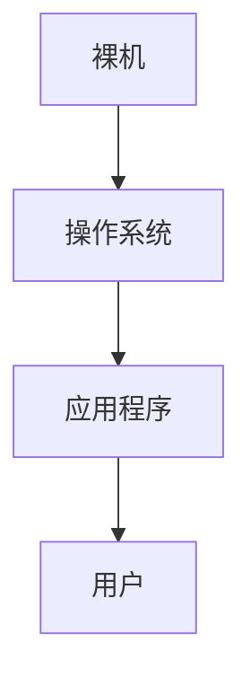

[toc!?depth=3]

----------

# 操作系统
## 概念（定义）
==操作系统 #EE3F4D==(Operating System，OS) 是指控制和==管理 #FC7930==整个计算机系统的==硬件和软件 #FC7930==资源，并合理地组织调度计算机的工作和资源的分配;以==提供给用户和其他软件方便的接口和环境 #FC7930==;它是计算机系统中最基本的==系统软件 #FC7930==。
### 层次结构

## 功能和目标
### 作为系统资源的管理者
#### 提供的功能
处理机管理
存储器管理
文件管理
设备管理
#### 目标
安全，高效
### 向上层提供方便易用的服务
#### 直接给用户使用的
GUI（图形用户界面）封装思想:操作系统把一-些丑陋的硬件功能封装成简单易用的服务，使用户能更方便地使用计算机，用户无需关心底层硬件的原理，只需要对操作系统发出命令即可
联机命令接口实例(Windows系统) 联机命令接口=交互式命令接口
脱机命令接口实例(Windows系统) 脱机命令接口=批处理命令接口
#### 给软件/给程序员使用的
程序接口：可以在程序中进行系统调用来使用程序接口。普通用户不能直接使用程序接口，只能通过程序代码间接使用。
### 作为最接近硬件的层次
通常把覆盖了软件的机器成为==扩充机器 #FC7930==，又称之为==虚拟机 #EE3F4D==

## 四个特征
### 并发
==并发 #EE3F4D==:指两个或多个事件在同一时间间隔内发生。这些事件==宏观上是同时发生 #FC7930==的，但微观上是交替发生的。
常考易混概念——==并行 #EE3F4D==:指两个或多个事件在同一时刻同时发生。
==操作系统的并发性 #EE3F4D==指计算机系统中“同时”运行着多个程序，这些程序宏观上看是同时运行看的，而微观上看是交替运行的。
操作系统就是伴随着“多道程序技术”而出现的。因此，==操作系统和程序并发是一起诞生的 #EE3F4D==。
重点：
==单核CPU #EE3F4D==同一时刻只能执行一个程序，各个程序只能==并发 #FC7930==地执行
==多核CPU #EE3F4D==同一时刻可以同时执行多个程序，多个程序可以==并行 #FC7930==地执行
### 共享
==共享 #EE3F4D==即资源共享，是指系统中的资源可供内存中多个并发执行的进程共同使用。
#### 互斥共享方式
系统中的某些资源，虽然可以提供给多个进程使用，但==一个时间段内只允许一个进程访问该资源 #FC7930==
#### 同时共享方式
系统中的某些资源，==允许一个时间段内由多个进程“同时”对它们进行访问 #FC7930==
所谓的“同时”往往是宏观上的，而在微观上，这些进程可能是交替地对该资源进行访问的(即分时共享)
==并发性 #EE3F4D==指计算机系统中同时存在着多个运行着的程序。
==共享性 #EE3F4D==是指系统中的资源可供内存中多个并发执行的进程共同使用。
### 虚拟
==虚拟 #EE3F4D==是指把一个物理上的实体变为若千个逻辑上的对应物。物理实体(前者)是实际存在的，而逻辑上对应物(后者)是用户感受到的。
一个程序需要放入内存并给它分配CPU才能执行
#### 空分复用技术(如虚拟存储器技术)
#### 时分复用技术(如虚拟处理器)
显然，如果失去了并发性，则一个时间段内系统中只需运行一道程序，那么就失去了实现虚拟性的意义了。因此，==没有并发性，就谈不上虚拟性 #EE3F4D==。
### 异步
==异步 #EE3F4D==是指，在多道程序环境下，允许多个程序并发执行，但由于资源有限，进程的执行不是一贯到底的，而是走走停停，以不可预知的速度向前推进，这就是进程的异步性。
如果失去了并发性，即系统只能串行地运行各个程序，那么每个程序的执行会一贯到底。只有系统拥有并发性，才有可能导致异步性。

## OS的发展与分类
学习提示:要重点关注和理解各类操作系统主要想解决的是什么问题，各自的优缺点。
### 手工操作阶段
主要缺点:用户独占全机、人机速度矛盾导致资源利用率极低
### 批处理阶段
#### 单道批处理系统
引入==脱机输入/输出技术 #EE3F4D==(用外围机+磁带完成)，并由==监督程序 #EE3F4D==负责控制作业的输入、输出
主要缺点:==内存中仅能有一道程序运行 #EE3F4D==，只有该程序运行结束之后才能调入下一-道程序。==CPU有大量的时间是在空闲等待I/O完成 #EE3F4D==。资源利用率依然很低。
#### 多道批处理系统(操作系统开始出现)
主要优点:多道程序==并发 #EE3F4D==执行，==共享 #EE3F4D==计算机资源。==资源利用率大幅提升 #EE3F4D==，CPU和其他资源更能保持“忙碌”状态，系统吞吐量增大。
主要缺点:用户响应时间长，==没有人机交互功能 #EE3F4D==(用户提交自己的作业之后就只能等待计算机处理完成，中间不能控制自己的作业执行。eg: 无法调试程序/无法在程序运行过程中输入一 些参数)
### 分时操作系统
分时操作系统:计算机以==时间片 #EE3F4D==为单位==轮流为各个用户/作业服务 #EE3F4D==，各个用户可通过终端与计算机进行交互。
主要优点:用户请求可以被即时响应，==解决了人机交互问题 #EE3F4D==。允许多个用户同时使用一台计算机，并且用户对计算机的操作相互独立，感受不到别人的存在。
主要缺点:==不能优先处理一些紧急任务 #EE3F4D==。 操作系统对各个用户/作业都是完全公平的，循环地为每个用户/作业服务-一个时间片，不区分任务的紧急性。
### 实时操作系统
主要优点:能够优先响应一些紧急任务，某些紧急任务不需时间片排队。
在实时操作系统的控制下，计算机系统接收到外部信号后及时进行处理，并且==要在严格的时限内处理完事件 #EE3F4D==。实时操作系统的主要特点是==及时性和可靠性 #EE3F4D==
#### 硬实时系统
必须在绝对严格的规定时间内完成处理
### 软实时系统
能接受偶尔违反时间规定
### 网络操作系统
是伴随着计算机网络的发展而诞生的，能把网络中各个计算机有机地结合起来，实现数据传送等功能，==实现网络中各种资源的共享(如文件共享)和各台计算机之间的通信 #EE3F4D==。 (如: Windows NT就是一种典型的网络操作系统，网站服务器就可以使用)
### 分布式操作系统
分布式操作系统:主要特点是==分布性和并行性 #EE3F4D==。系统中的各台计算机地位相同，==任何工作都可以分布在这些计算机上，由它们并行、协同完成这个任务。 #EE3F4D==
### 个人计算机操作系统
如Windows XP、MacOS，方便个人使用。

## 运行机制

