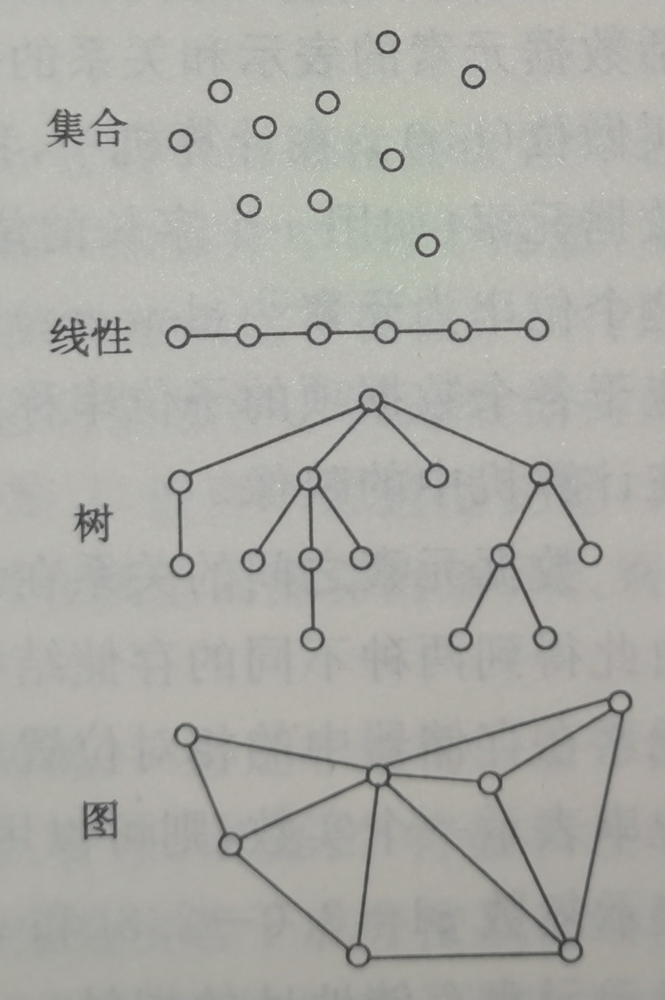

将问题信息化后进行处理
----------
1.1什么是数据结构

数据：
数据是==信息的载体 #EE3F4D==，是描述客观事物属性的数、字符及所有能输入到计算机中并==被计算机程序识别和处理 #EE3F4D==的符号的集合。数据是计算机程序加工的原料。

现代计算机——经常处理==非数值 #EE3F4D==型问题
对于非数值型的问题：
1．我们关心每个个体的具体信息
2．我们还关心个体之间的关系

1.2基本概念和术语
==数据 #FC7930==（ data ）是对客观事物的符号表示，在计算机科学中是指所有能输入到计算机中并被计算机程序处理的符号的总称。它是计算机程序加工的"==原料 #EE3F4D=="。
==数据 #FC7930==元素（ dataelement ）是数据的基本单位，在计算机程序中通常作为一个整体进行考虑和处理。有时，一个数据元素可由若干个==数据项 #FC7930==（ dataitem ）组成， 数据项是数据的不可分割的最小单位。
==数据对象 #FC7930==（ dataobject ）是性质相同的数据元素的集合，是数据的一个子集。
==数据结构 #FC7930==（ datastructure ）是相互之间存在一种或多种特定关系的数据元素的集合。
在任何问题中，数据元素都不是孤立存在的，而是在它们之间存在着某种关系，这种数据元素相互之间的关系称为==结构 #FC7930==（ structure )。

根据数据元素之间关系的不同特性，通常有下列4类基本结构（如下图所示）：
(1）==集合 #FC7930==结构中的数据元素之间除了"同属于一个集合"的关系外，别无其他关系；
(2）==线性 #FC7930==结构结构中的数据元素之间存在一个对一个的关系；
(3）==树形 #FC7930==结构结构中的数据元素之间存在一个对多个的关系；
(4）==图状 #FC7930==结构或==网状 #FC7930==结构结构中的数据元素之间存在多个对多个的关系。

