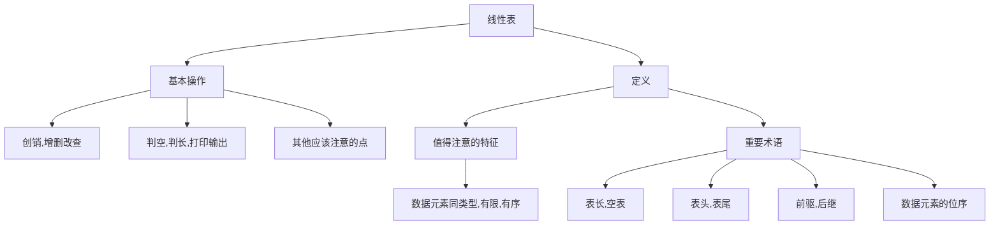

[toc!?depth=3]

第二到第四章研究线性结构
----------
# 线性结构
## 特点(p18)
 (1)在非空有限集中；
 (2)只有一个"第一个"数据元素；
 (3)除第一个，每一个数据元素均只有一个前驱；
 (4)除最后一个，每一个数据元素均只有一个后驱；

## 线性表的类型定义(p19)
==线性表 #EE3F4D==是具有相同数据类型的n(n>=0)个==数据元素 #FC7930==的有限序列，其中n为表长，当n=0时线性表是一个空表。若用L命名线性表，则其一般表示为
L=(a1,a2,...,aj,aj+1,...,an)

线性表的基本操作
intList(&L)：初始化表。
DestroyList(&L)：销毁操作。

ListInsert(&L,i,e):插入操作。
ListDelete(&L,i,&e):删除操作。

LocateElem(L,e):按值查找操作。
GetElem(L,i):按位查找操作。

其他常用操作：
Length(L):求表长。
PrintList(L):输出操作。
Empty(L):判空操作。
 
 请看下面的代码
```c++
#include<stdio.h>
 
void test(int x){
x=1024;
printf("test函数内部 x=%d\n",x);
}

int main(){
int x=1;
printf("调用test前 x=%d\n",x);
test(x);
printf("调用test后 x=%d\n",x);
}
```
发现调用后x的值还是为1，但是内部的值为1024，但是如果在void后面的x前加上&，它的值就会变成1024.当我们需要将某个数的值带回时就需要加上&。




