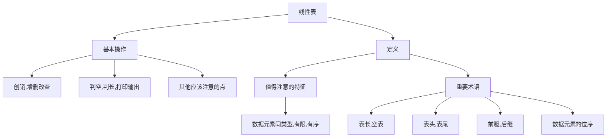

[toc!?depth=4]

第二到第四章研究线性结构
----------
# 线性结构
## 特点(p18)
 (1)在非空有限集中；
 (2)只有一个"第一个"数据元素；
 (3)除第一个，每一个数据元素均只有一个前驱；
 (4)除最后一个，每一个数据元素均只有一个后驱；

## 线性表的类型定义(p19)
==线性表 #EE3F4D==是具有相同数据类型的n(n>=0)个==数据元素 #FC7930==的有限序列，其中n为表长，当n=0时线性表是一个空表。若用L命名线性表，则其一般表示为
L=(a1,a2,...,aj,aj+1,...,an)

线性表的基本操作
intList(&L)：初始化表。
DestroyList(&L)：销毁操作。

ListInsert(&L,i,e):插入操作。
ListDelete(&L,i,&e):删除操作。

LocateElem(L,e):按值查找操作。
GetElem(L,i):按位查找操作。

其他常用操作：
Length(L):求表长。
PrintList(L):输出操作。
Empty(L):判空操作。
 
 请看下面的代码
```c++
#include<stdio.h>
 
void test(int x){
x=1024;
printf("test函数内部 x=%d\n",x);
}

int main(){
int x=1;
printf("调用test前 x=%d\n",x);
test(x);
printf("调用test后 x=%d\n",x);
}
```
发现调用后x的值还是为1，但是内部的值为1024，但是如果在void后面的x前加上&，它的值就会变成1024.当我们需要将某个数的值带回时就需要加上&。



## 顺序表
用顺序储存的方式实现线性表

### 动态分布

```c++
#define IntSize 10 //顺序表的初始长度
typedef struct{
ElemType *data;// 指示动态分配数组的指针
int Maxsize;//顺序表的最大容量
int length;//顺序表的当前长度
} SeqList;//顺序表的类型定义（动态分布方式）
```

### 特点
#### 随机访问
#### 存储密度高
#### 拓展容量不方便
#### 插入删除操作不方便

### 基本操作
#### 插入
代码如下(优化过的)

```c++
#define MaxSize 10//定义最大长度
typedef struct{
int data[MaxSize];//用静态的“数组”存放数据元素
int length;//顺序表的当前长度
} SqList;//顺序表的类型定义

bool ListInsert(SqList &L,int i,int e){
if(i<1||i>L.length+1)//判断i的范围是否有效
return false;
if(L.length>=MaxSize)//储存空间已满，不能插入
return false;
for(int j=L.length;j>=i;j--)//将第i个元素及之后的元素后移
L.data[j]=L.data[j-1];
L.data[j-1]=e;//在位置i处放入e
L.length++;//长度加1
return true；
}
```

#### 删除
代码如下

```c++
bool ListDelete(SqList &L,int i,int &e){
if(i<1||i>L.length+1)//判断i的范围是否有效
return false;
e=L.data[i-1];//将被删除的元素赋值给e
for(int j=i;j<L.length;j++)//将第i个元素及之后的元素前移
L.data[j-1]=L.data[j];
L.length--;//线性表长度减1
return true；
}

int main(){
SqList L;//声明一个顺序表
InitList(L);//初始化顺序表
//...此处省略一些代码，插入几个元素
int e=-1;//用变量e吧删除的元素“带回来”
if(ListDelete(L,3,e))
printf("已删除第3个元素，删除元素=d\n",e);
else
printf("位序i不合法，删除失败\n");
return 0;
}
```


