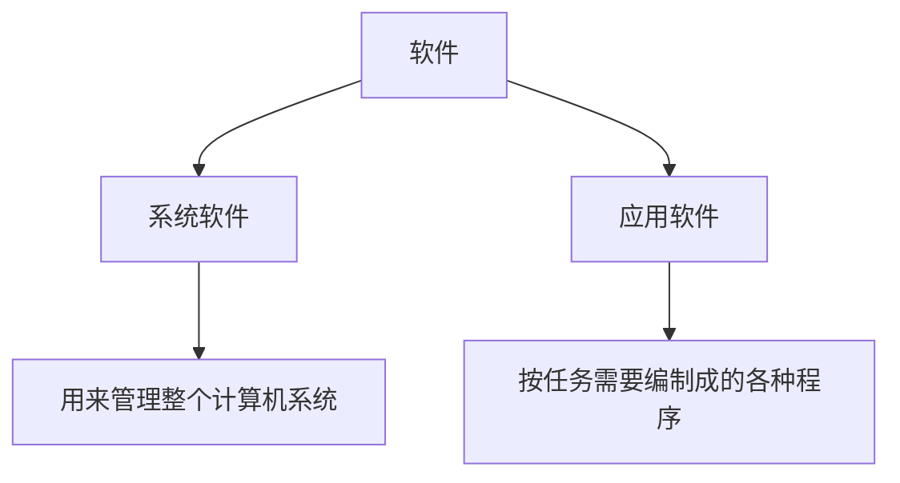
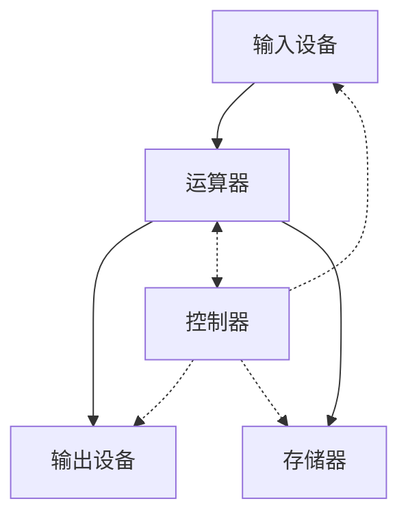
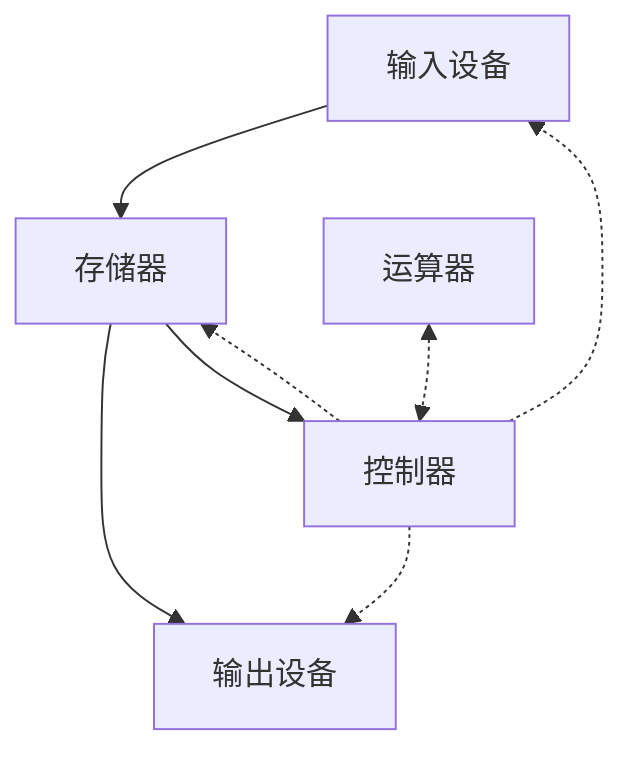

[toc!?depth=3]

----------

# 计算机的发展历程
## 什么是计算机系统
### 硬件+软件
计算机系统=硬件+软件

## 硬件的发展（重点）
### 第一代:电子管时代
### 第二代:晶体管时代
### 第三代:中小规模集成电路时代
### 第四代:大规模、超大规模集成电路时代
## 软件的发展
## 目前的发展趋势
### 更微型、多用途
### 更巨型、超高速

# 计算机硬件的基本组成
## 五大部分
### 输入设备
将信息转换成机器能识别的形式
### 输出设备
将结果转换成人们熟悉的形式
### 生存储器
存放数据和程序
### 运算器
算术运算、逻辑运算
### 控制器
指挥各部件，使程序运行
## 早期冯诺依曼机的结构
“存储程序”的概念是指将指令以二进制代码的形式事先输入计算机的主存储器

——>数据线
<- ->控制线和反馈线
### 冯.诺依曼计算机的特点
1.计算机由五大部件组成
2.指令和数据以同等地位存于存储器，可按地址寻访
3.指令和数据用二进制表示
4.指令由操作码和地址码组成
5.存储程序
6.以运算器为中心
## 现代计算机的结构
现代计算机:以存储器为中心

CPU=运算器+控制器

# 各个硬件的工作原理
## 主存储器的基本组成
### 存储体
数据在存储体内按地址存储
### MAR
Memory Add ress Register(存储地址寄存器)
MAR=4位-->总共有2^4^个存储单元
MAR位数反映存储单元的个数
### MDR
Memory Data Register(存储数据寄存器)
MDR位数=存储字长
MDR=16位-->每个存储单元可存放16bit,
1个字(word) = 16bit，1个字节(Byte)1= 8bit，1B=1个字节，1b=1个bit
## 运算器的基本组成
运算器:用于实现算术运算(如:加减乘除)、逻辑运算(如:与或非)
### ACC
累加器，用于存放操作数，或运算结果。
### MQ
乘商寄存器，在乘、除运算时，用于存放操作数或运算结果。
### X
通用的操作数寄存器，用于存放操作数
### ALU(核心部件)
算术逻辑单元，通过内部复杂的电路实现算数运算、逻辑运算