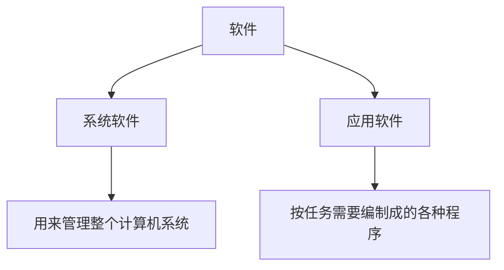

[toc!?depth=3]

----------

# 计算机的发展历程
## 什么是计算机系统
### 硬件+软件
计算机系统=硬件+软件

## 硬件的发展（重点）
### 第一代:电子管时代
### 第二代:晶体管时代
### 第三代:中小规模集成电路时代
### 第四代:大规模、超大规模集成电路时代
## 软件的发展
## 目前的发展趋势
### 更微型、多用途
### 更巨型、超高速

# 计算机硬件的基本组成
## 早期冯诺依曼机的结构
“存储程序”的概念是指将指令以二进制代码的形式事先输入计算机的主存储器
```sequence
小明->小李: 你好 小李, 最近怎么样?
Note right of 小李: 小李想了想
小李-->小明: 还是老样子
```
## 现代计算机的结构