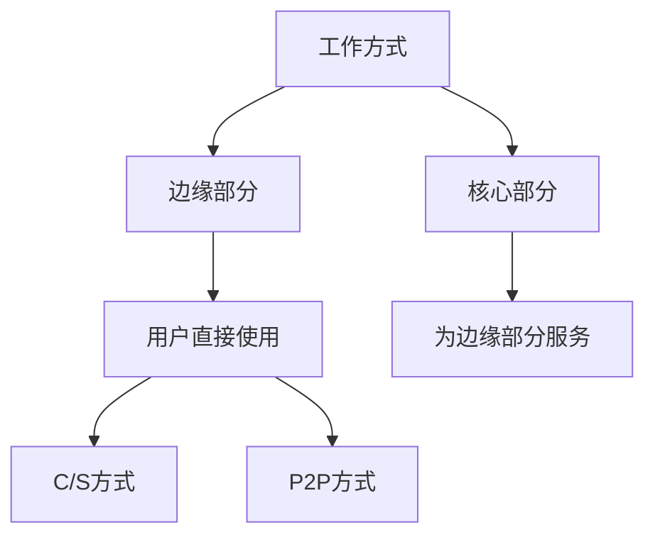
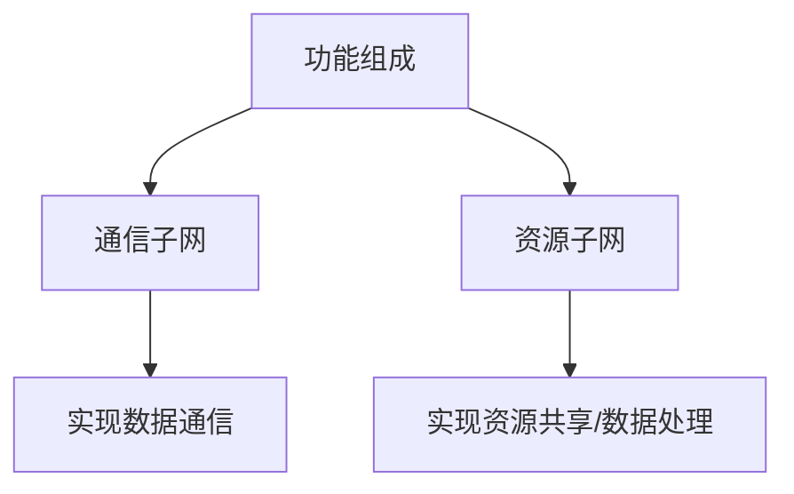
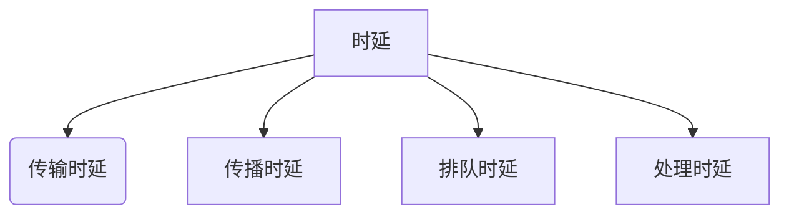
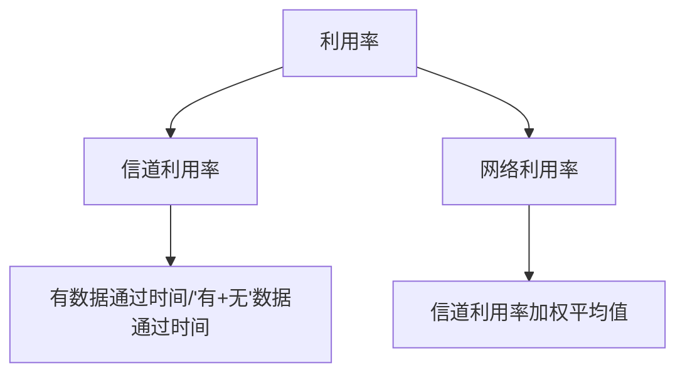
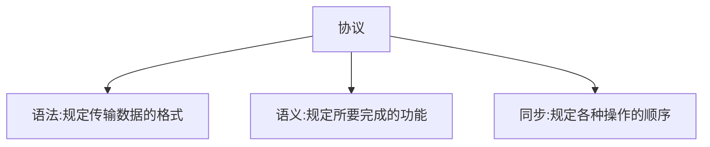
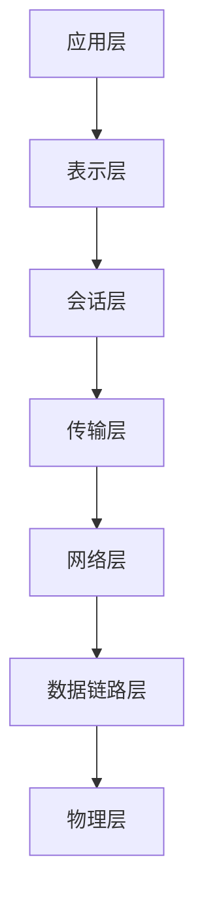

[toc!?depth=3]

----------

 掌握
 1.基本概念、基本原理、基本方法
 2.体系结构、网络协议、网络设备
 3.网络系统的分析、设计和应用
 
# 计网体系结构

## 计算机网络概述
### 概念、组成、功能、分类
#### 概念
网络：网样的东西或网状系统。
计算机网络是一个将分散的、具有独立计算功能的==计算机系统 #EE3F4D==，通过==通信设备 #EE3F4D==与==线路 #EE3F4D==连接起来，由功能完善的==软件 #EE3F4D==实现==资源共享 #12AA9C==和==信息传递 #12AA9C==的系统。
#### 功能
1.数据通信：同一个计算机网络上的其他计算机可使用某台计算机的计算机资
源的行为，可共享==硬件、软件、数据 #EE3F4D==。
2.资源共享：
3.分布式处理：多台计算机各白承担同一工作任务的不同部分。可提高可靠性以及实现负载均衡。
#### 计算机网络的发展阶段
第一阶段：
ARPAnet 阿帕网——>internet(interconnected network)互联网——>Internet因特网
第二阶段：
国家科学基金网(NSFNET)
第三阶段：
ISP(因特网服务提供者/因特网服务提供商)
#### 组成
1.组成部分：软件、硬件、协议(一系列规则和约定的集合)
2.工作方式：

3.功能组成
资源子网：实现资源共享功能的设备和软件的集合。
通信子网：各种传输介质、通信设备、相应的网络协议组成。

#### 分类
1.按分布范围分：广域网WAN(交换技术) 城域网MAN 局域网LAN(广播技术) 个人区域网PAN
2.按使用者分：公用网和专用网
3.按交换技术分：电路交换、报文交换和分组交换
4.按拓扑结构分：总线型、星型、环形和网状型(常用于广域网)
5.按传输技术分：广播式网络(共享公共通信信道)、点对点网络(使用分组存储转发和路由选择机制)

### 标准化工作及相关组织
#### 标准化工作
要实现不同厂商的硬，软件之间相互连通，必须遵从统一的标准。
1.标准的分类：法定标准：由权威机构制定的正式的、合法的标准    OSI
                   事实标准：某些公司的产品在竞争中占据了主流，    TCP/IP
                                   时间长了，这些产品中的协议和技术
                                   就成了标准
2.RFC (Request For Comments)  因特网标准的形式
  RFC要上升为因特网正式标准的四个阶段:
  1)因特网草案(Internet Draft)      这个阶段还不是RFC文档。
  2)建议标准(Proposed Standard)  从这个阶段开始成为RFC文档。
   IETF、IAB
  4)因特网标准(Internet Standard)	
#### 标准化工作的相关组织
国际标准化组织SO                OSI模型、HDLC协议
国际电信联盟ITU                  制定通信规则
电气和电子工程师协会EEE     学术机构、IEE802系列标准、 5G
Internet工程任务组ETF          负责因特网相关标准的制定  RFC XXXX

### 性能指标（重点）
#### 速率
速率即数据率或称数据传输率或比特率。
千1kb/s=10^3^b/s
兆1Mb/s=10^3^kb/s=10^6^b/s
吉1Gb/s=10^3^Mb/s=10^6^kb/s=10^9^b/s
太1Tb/s=10^3^Gb/s=10^6^Mb/s=10^9^kb/s= 10^12^b/s
存储容量：
1KB=2^10^B=1024B=1024* 8b
1MB=2^10^KB= 1024KB
1GB=2^10^MB=1024MB
1TB=2^10^GB=1024GB
#### 带宽
(1) “带宽”原本指某个信号具有的频带宽度，即最高频率与最低频率之差，单位是赫兹(Hz) 。
(2)计算机网络中，带宽用来表示网络的通信线路传送数据的能力，通常是指单位时间内从网络中的某一点到另一点所能通过的“最高数据率”。单位是“比特每秒”，b/s, kb/s，Mb/s，Gb/s。(网络设备所支持的最高速率且是指发送的速率而不是传输速率)
#### 吞吐量
表示在单位时间内通过某个网络(或信道、接口)的数据量。单位b/s, kb/s， Mb/s等 
吞吐量受网络的带宽或网络的额定速率的限制。
#### 时延

发送时延：从发送分组的第一个比特算起，到该分组的最后一个比特发送完毕所需的时间。(数据长度/信道带宽)
传播时延：取决于电磁波传播速度和链路长度。(信道长度/电磁波在信道上的传播速率)
排队时延：等待输出/入链路可用。
处理时延：检错找出口。
对于高速网络链路，我们只提高发送速率。
#### 时延带宽积
传播时延* 带宽，时延带宽积又称为以比特为单位的链路长度。即“某段链路现在有多少比特“。
#### 往返时延RTT
从发送方发送数据开始，到发送方收到接收方的确认(按收方收到数据后立即发送确认),总共经历的时延。RTT越大，在收到确认之前，可以发送的数据越多。(不包括传播时延)
```mermaid!
graph TD;
RTT-->往返传播时延=传播时延*2;
RTT-->末端处理时间;
```
利用率：



## 体系结构&参考模型
### 分层结构
#### 基本原则
1.各层之间相互==独立 #EE3F4D==，每层只实现一种相对独立的功能。
2.每层之间==界面自然清晰 #EE3F4D==，易于理解，相互交流尽可能少。
3.结构.上可分割开。每层都采用==最合适的技术 #EE3F4D==来实现。
4.保持==下层 #EE3F4D==对==上层 #EE3F4D==的独立性，上层单向使用下层提供的服务。
5.整个分层结构应该能促进标准化工作。
#### 基本概念
实体:第n层中的活动元素称为n层实体。同一层的实体叫对等实体。

### 协议、接口、服务
#### 协议
为进行网络中的对等实体数据交换而建立的规则、标准或约定称为网络协议。[水平]

#### 接口(访问服务点SAP) 
上层使用下层服务的入口。
#### 服务
下层为相邻上层提供的功能调用。[垂直]
SDU服务数据单元:为完成用户所要求的功能而应传送的数据。
PCI协议控制信息:控制协议操作的信息。
PDU协议数据单元:对等层次之间传送的数据单位。

### ISO/OSI模型（重点）
#### 7层OSI参考模型(法定标准)
目的:支持==异构网络系统 #EE3F4D==的互联互通。
国际标准化组织(ISO) 于1984年提出开放系统互连(OSI) 参考模型。

物链网输会示用(口诀)
通信子网：物链网
资源子网：会示用
上面四层：端到端；下面四层：点到点；即传输时中间系统不会管上面四层，只关心通信子网。
在每层往下传递时都会加上控制信息。注：数据链路层会加两次(因为字多)，物理层不加(没有下一层)。
#### 应用层
所有能和用户交互产生网络流量的程序(qq，邮箱等)
典型应用层服务:文件传输(FTP)、电子邮件(SMTP)、万维网(HTTP)等
#### 表示层
用于处理在两个通信系统中交换信息的表示方式(语法和语义)
功能一:数据格式变换(翻译官)
功能二:数据加密解密
功能三:数据压缩和恢复
#### 会话层
向表示层实体/用户进程提供==建立连接 #EE3F4D==并在连接上有序地==传输数据 #EE3F4D==。
是会话，也是建立同步(SYN)
功能一:建立、管理、终止会话
功能二:使用校验点可使会话在通信失效时从校验点/同步点继续恢复通信，实现数据同步。适用于传输大文件。
#### 传输层
负责主机中两个进程的通信，即==端到端 #EE3F4D==的通信。传输单位是报文段或用户数据报。
功能一:==可 #EE3F4D==靠传输、不可靠传输
功能二:==差 #EE3F4D==错控制
功能三:==流 #EE3F4D==量控制(控制发射方速度)
功能四:复==用 #EE3F4D==分用(复用:多个应用层进程可同时使用下面运输层的服务。分用:运输层把收到的信息分别交付给上面应用层中相应的进程。)
#### 网络层
主要任务是把==分组 #EE3F4D==从源端传到目的端，为分组交换网上的不同主机提供通信服务。
网络层传输单位是==数据报 #EE3F4D==。
功能一:路由选择
功能二:流量控制
功能三:差错控制
功能四:拥塞控制(若所有结点都来不及接受分组，而要丢弃大量分组的话，网络就处于拥塞状态。因此要采取一定措施,缓解这种拥塞。)
#### 数据链路层
主要任务是把网络层传下来的数据报==组装成帧 #EE3F4D==。
数据链路层/链路层的传输单位是==帧 #EE3F4D==。
功能一:成帧(定义帧的开始和结束)
功能二:差错控制  ==帧错+位错 #EE3F4D==
功能三:流量控制
功能四:访问(接入)控制  ==控制对信道的访问 #EE3F4D==
#### 物理层
主要任务是在==物理媒体 #EE3F4D==上实现比特流的==透明传输 #EE3F4D==。
物理层传输单位是==比特 #EE3F4D==。
==透明传输 #EE3F4D==:指不管所传数据是什么样的比特组合,都应当能够在链路上传送。
功能一:定义接口特性
功能二:定义传输模式  ==单工、半双工、双工 #EE3F4D==
功能三:定义传输速率
功能四:比特同步
功能五:比特编码
主要协议:Rj45、802.3
### TCP/IP模型（重点）
#### 4层TCP/IP参考模型(事实模型)