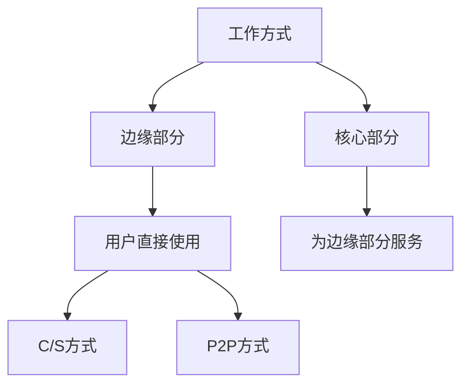
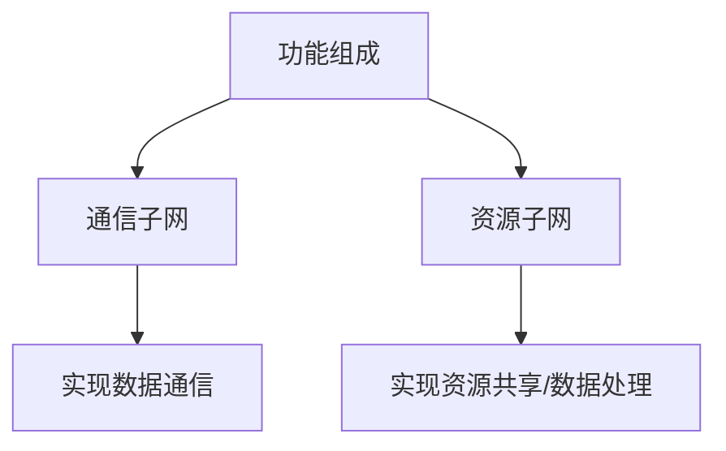

[toc!?depth=3]

----------

 掌握
 1.基本概念、基本原理、基本方法
 2.体系结构、网络协议、网络设备
 3.网络系统的分析、设计和应用
 
# 计网体系结构

## 计算机网络概述
### 概念、组成、功能、分类
#### 概念
网络：网样的东西或网状系统。
计算机网络是一个将分散的、具有独立计算功能的==计算机系统 #EE3F4D==，通过==通信设备 #EE3F4D==与==线路 #EE3F4D==连接起来，由功能完善的==软件 #EE3F4D==实现==资源共享 #12AA9C==和==信息传递 #12AA9C==的系统。
#### 功能
1.数据通信：同一个计算机网络上的其他计算机可使用某台计算机的计算机资
源的行为，可共享==硬件、软件、数据 #EE3F4D==。
2.资源共享：
3.分布式处理：多台计算机各白承担同一工作任务的不同部分。可提高可靠性以及实现负载均衡。
#### 计算机网络的发展阶段
第一阶段：
ARPAnet 阿帕网——>internet(interconnected network)互联网——>Internet因特网
第二阶段：
国家科学基金网(NSFNET)
第三阶段：
ISP(因特网服务提供者/因特网服务提供商)
#### 组成
1.组成部分：软件、硬件、协议(一系列规则和约定的集合)
2.工作方式：

3.功能组成
资源子网：实现资源共享功能的设备和软件的集合。
通信子网：各种传输介质、通信设备、相应的网络协议组成。

#### 分类
1.按分布范围分：广域网WAN(交换技术) 城域网MAN 局域网LAN(广播技术) 个人区域网PAN
2.按使用者分：公用网和专用网
3.按交换技术分：电路交换、报文交换和分组交换
4.按拓扑结构分：总线型、星型、环形和网状型(常用于广域网)
5.按传输技术分：广播式网络(共享公共通信信道)、点对点网络(使用分组存储转发和路由选择机制)

### 标准化工作及相关组织
#### 标准化工作
要实现不同厂商的硬，软件之间相互连通，必须遵从统一的标准。
1.标准的分类：法定标准：由权威机构制定的正式的、合法的标准    OSI
                   事实标准：某些公司的产品在竞争中占据了主流，    TCP/IP
                                   时间长了，这些产品中的协议和技术
                                   就成了标准
2.RFC (Request For Comments)  因特网标准的形式
RFC要上升为因特网正式标准的四个阶段:
  1)因特网草案(Internet Draft)      这个阶段还不是RFC文档。
  2)建议标准(Proposed Standard)  从这个阶段开始成为RFC文档。
   IETF、IAB
  4)因特网标准(Internet Standard)	
#### 标准化工作的相关组织
国际标准化组织SO                OSI模型、HDLC协议
国际电信联盟ITU                  制定通信规则
电气和电子工程师协会EEE     学术机构、IEE802系列标准、 5G
Internet工程任务组ETF          负责因特网相关标准的制定  RFC XXXX

### 性能指标（重点）
#### 速率
速率即数据率或称数据传输率或比特率。
千1kb/s=10^3^b/s
兆1Mb/s=10^3^kb/s=10^6^b/s
吉1Gb/s=10^3^Mb/s=10^6^kb/s=10^9^b/s
太1Tb/s=10^3^Gb/s=10^6^Mb/s=10^9^kb/s= 10^12^b/s
存储容量：
1KB=2^10^B=1024B=1024*8b
1MB=2^10^KB= 1024KB
1GB=2^10^MB=1024MB
1TB=2^10^GB=1024GB
## 体系结构&参考模型
### 分层结构
### 协议、接口、服务
### ISO/OSI模型（重点）
### TCP/IP模型（重点）